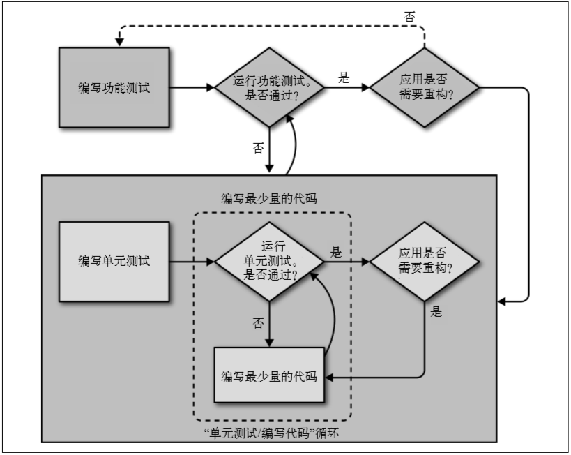

[toc]
# python_web_tdd

python web 驱动测试代码demo及各章知识点

### 各章知识点传送门
- [第一章:使用功能测试协助安装Django](https://github.com/evilmao/python_web_tdd/tree/v1.0)
- [第二章:使用unittest模块扩展功能测试](https://github.com/evilmao/python_web_tdd/tree/v2.0)
- [第三章:使用单元测试测试简单的页面](https://github.com/evilmao/python_web_tdd/tree/v3.1)
- [第四章:编写这些测试有什么用](https://github.com/evilmao/python_web_tdd/tree/v4.0)

### 本章知识点

#### 4.1 TDD流程
    a.功能测试;
    b.单元测试;
    c."编写测试/编写代码" 循环;
    d.重构

**1.流程图**


> 说明: 首先编写一个测试，运行这个测试看着它失败。然后编写最少量的代码取得一些进展，再 运行测试。如此不断重复，直到测试通过为止。最后，或许还要重构代码，测试能确保不 破坏任何功能。

**2.如果既有功能测试又有单元测试应该怎么运用这个流程呢?**

  

> 编写一个功能测试，看着它失败。接下来，“编写代码让它通过”这一步是一个小型 TDD 循环：编写一个或多个单元测试，然后进入“单元测试 / 编写代码”循环，直到单元测试 通过为止。然后回到功能测试，查看是否有进展，这一步还可以多编写一些应用代码，再 编写更多的单元测试，如此一直循环下去。

**3.牵涉到功能测试时应该怎么重构呢?**
```markdown
- 要使用功能测试检查重构前后的表现是否一致。不过，可以修改、添加或删除单元测试，或者使用单元测试循环修改实现方式。
- 功能测试是应用是否能正常运行的最终评判。单元测试只是整个开发过程中的一个辅助工具。
```
